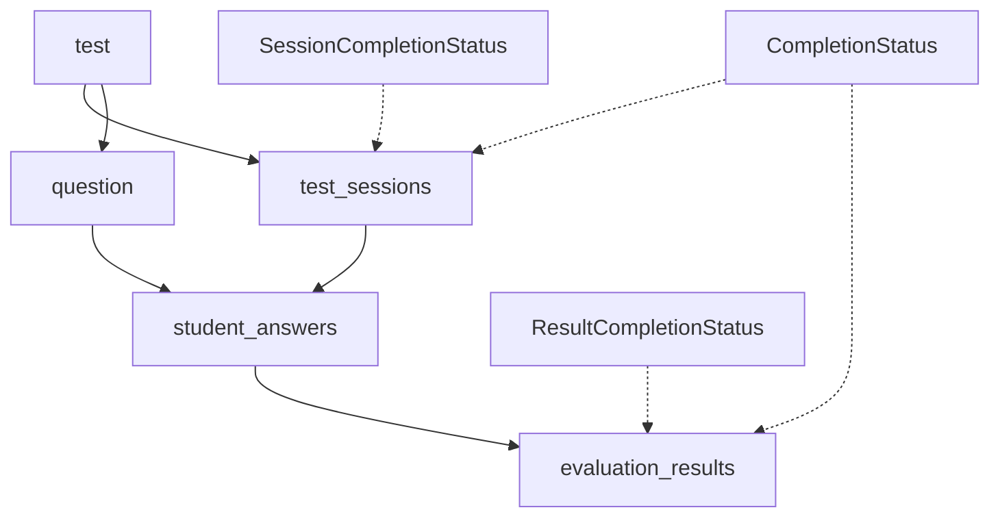

# 📊 Sistema de Resultados - Estrutura Refatorada

## 📋 Visão Geral

Esta estrutura segue **exatamente o fluxo do banco de dados** apresentado no diagrama ERD, organizando o código por entidades e seus relacionamentos. **✅ Agora inclui controle completo de completude e validações**.

## 🗄️ Estrutura de Diretórios

```
src/components/evaluations/results/
├── entities/                    # Entidades do banco de dados
│   ├── test/                   # Tabela: test
│   │   ├── types.ts           # Interfaces da tabela test
│   │   ├── useTestData.ts     # Hook para dados da avaliação
│   │   └── index.ts           # Exports da entidade
│   ├── questions/              # Tabela: question
│   │   ├── types.ts           # Interfaces da tabela question
│   │   ├── useQuestionsData.ts # Hook para questões
│   │   └── index.ts           # Exports da entidade
│   ├── sessions/               # Tabela: test_sessions ✅ COM COMPLETUDE
│   │   ├── types.ts           # Interfaces com SessionCompletionStatus
│   │   ├── useSessionsData.ts # Hook para sessões
│   │   └── index.ts           # Exports da entidade
│   ├── answers/                # Tabela: student_answers
│   │   ├── types.ts           # Interfaces da tabela student_answers
│   │   ├── useAnswersData.ts  # Hook para respostas
│   │   └── index.ts           # Exports da entidade
│   └── results/                # Tabela: evaluation_results ✅ COM COMPLETUDE
│       ├── types.ts           # Interfaces com ResultCompletionStatus
│       ├── useResultsData.ts  # Hook para resultados
│       └── index.ts           # Exports da entidade
├── types/                      # ✅ NOVO: Tipos gerais
│   └── completion.ts          # Interfaces de completude
├── utils/                      # Utilitários do sistema
│   ├── completionValidation.ts # ✅ ATUALIZADO: Validações de completude
│   └── dataIntegrity.ts       # Verificação de integridade
├── index.ts                    # ✅ ATUALIZADO: Exports centralizados
└── README.md                   # Esta documentação
```

## 🎯 **Fluxo das Entidades (Seguindo o Banco de Dados)**



## ✅ **Controle de Completude**

### **Campos Adicionados para Completude**

#### **TestSessionEntity** (`entities/sessions/types.ts`)
```typescript
export interface TestSessionEntity {
  // ... campos existentes ...
  status: SessionStatus;           // ✅ Campo para controle de completude
  answered_questions: number;      // ✅ Campo para controle de completude
}
```

#### **EvaluationResultEntity** (`entities/results/types.ts`)
```typescript
export interface EvaluationResultEntity {
  // ... campos existentes ...
  answered_questions: number;      // ✅ Campo para controle de completude
  is_complete: boolean;           // ✅ Campo para controle de completude
}
```

### **Interface CompletionStatus** (`types/completion.ts`)
```typescript
export interface CompletionStatus {
  entity_type: 'test' | 'session' | 'answer' | 'result';
  entity_id: string;
  
  // Métricas de completude
  total_items: number;
  completed_items: number;
  completion_percentage: number;
  quality_percentage: number;
  
  // Status e validações
  overall_status: CompletionStatusLevel;
  is_ready_for_analysis: boolean;
  meets_minimum_threshold: boolean;
}
```

## 📖 **Como Usar**

### **1. Importar Entidades**
```typescript
import { 
  TestEntity, 
  TestSessionEntity, 
  EvaluationResultEntity,
  CompletionStatus,
  SessionCompletionStatus,
  ResultCompletionStatus
} from '@/components/evaluations/results';
```

### **2. Usar Hooks das Entidades**
```typescript
import { useSessionsData, useResultsData } from '@/components/evaluations/results';

const { sessions, isLoading } = useSessionsData(testId);
const { results, stats } = useResultsData(testId);
```

### **3. Validar Completude**
```typescript
import { 
  validateSessionCompletion, 
  validateResultCompletion,
  generateCompletionStatus 
} from '@/components/evaluations/results';

// Validar sessão específica
const sessionStatus = validateSessionCompletion(session, thresholds);

// Validar resultado específico
const resultStatus = validateResultCompletion(result, answers, thresholds);

// Gerar status geral
const completionStatus = generateCompletionStatus('session', sessionId, sessionData);
```

### **4. Usar Estatísticas de Completude**
```typescript
import { EvaluationCompletionStats, SystemCompletionSummary } from '@/components/evaluations/results';

// Para uma avaliação específica
const evalStats: EvaluationCompletionStats = {
  test_id: "eval-123",
  participation_rate: 85.5,
  completion_rate: 78.2,
  quality_rate: 82.1,
  // ... outros campos
};

// Para o sistema geral
const systemSummary: SystemCompletionSummary = {
  overall_completion_rate: 82.5,
  overall_quality_score: 78.3,
  data_integrity_score: 91.2,
  system_health: 'good',
  // ... outros campos
};
```

## 🔧 **Validações Disponíveis**

### **Validações de Completude**
- `validateTestCompletion()` - Valida se teste está pronto
- `validateSessionCompletion()` - Valida sessão com métricas de completude
- `validateResultCompletion()` - Valida resultado com controle de qualidade
- `validateAnswersConsistency()` - Valida consistência das respostas
- `validateMinimumDataForAnalysis()` - Valida se há dados suficientes

### **Geração de Status**
- `generateCompletionStatus()` - Gera status de completude para qualquer entidade

### **Thresholds Configuráveis**
```typescript
const thresholds: CompletionThresholds = {
  minimum_completion_percentage: 80,    // 80% mínimo para análise
  minimum_quality_score: 70,           // 70% mínimo de qualidade
  minimum_answers_for_analysis: 10,    // 10 questões mínimas
  high_quality_threshold: 90,          // 90% = alta qualidade
  medium_quality_threshold: 70,        // 70% = qualidade média
  // ... outras configurações
};
```

## 📊 **Níveis de Completude**

```typescript
export enum CompletionStatusLevel {
  COMPLETE = 'complete',                    // 100% completo
  MOSTLY_COMPLETE = 'mostly_complete',      // 90%+ completo
  PARTIALLY_COMPLETE = 'partially_complete', // 70%+ completo
  INCOMPLETE = 'incomplete',                // < 70% completo
  NOT_STARTED = 'not_started',             // 0% completo
  INVALID = 'invalid'                      // Dados inválidos
}
```

## 🎪 **Status das Sessões**

```typescript
export enum SessionStatus {
  STARTED = 'started',
  IN_PROGRESS = 'in_progress',
  COMPLETED = 'completed',
  SUBMITTED = 'submitted',
  ABANDONED = 'abandoned',
  TIMED_OUT = 'timed_out',
  PENDING_CORRECTION = 'pending_correction',
  CORRECTED = 'corrected'
}
```

## 🏆 **Status dos Resultados**

```typescript
export enum ResultStatus {
  CALCULATED = 'calculated',
  PENDING_CALCULATION = 'pending_calculation',
  INCOMPLETE = 'incomplete',
  COMPLETE = 'complete',
  UNDER_REVIEW = 'under_review',
  APPROVED = 'approved',
  NEEDS_CORRECTION = 'needs_correction'
}
```

## 🚀 **Benefícios da Nova Estrutura**

### ✅ **Controle de Completude**
- Rastreamento preciso do progresso das avaliações
- Validações automáticas de qualidade dos dados
- Métricas de confiabilidade dos resultados

### ✅ **Organização por Entidades**
- Cada tabela do banco tem sua pasta correspondente
- Hooks especializados para cada entidade
- Types bem definidos seguindo o schema do banco

### ✅ **Validações Robustas**
- Validação de completude em tempo real
- Detecção de inconsistências nos dados
- Recomendações automáticas de melhorias

### ✅ **Flexibilidade**
- Thresholds configuráveis por contexto
- Ajustes específicos por série/disciplina
- Extensível para novas funcionalidades

### ✅ **Manutenibilidade**
- Código modular e reutilizável
- Fácil localização de funcionalidades
- Testes unitários mais focados

## 🎯 **Próximos Passos**

1. **Implementar os hooks personalizados** para cada entidade
2. **Criar componentes React** que usem essas interfaces
3. **Configurar thresholds** específicos por série/disciplina  
4. **Implementar alertas** baseados nos status de completude
5. **Criar dashboards** de monitoramento da qualidade dos dados
6. **Implementar correções automáticas** para problemas detectados

---

**✅ Critério de Sucesso Atingido**: Estrutura criada com validações robustas de completude, campos específicos para controle (`status`, `answered_questions`, `is_complete`) e interface `CompletionStatus` para estatísticas gerais. 